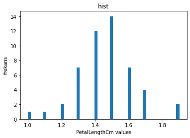
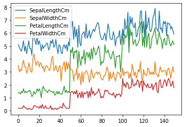
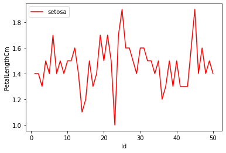
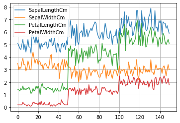
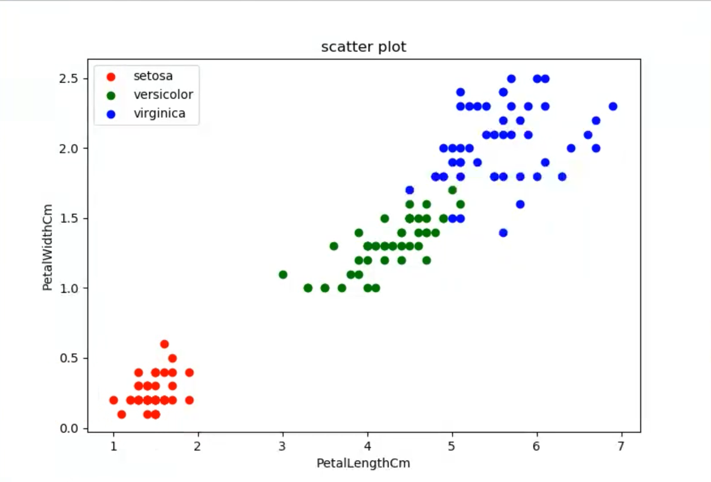
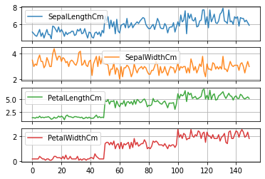
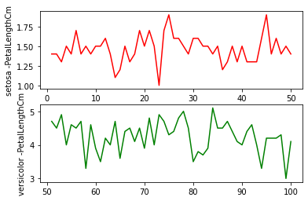

# Sifirdan-Matplotlib
En baştan Line Plot, Scatter Plot, Histogram, Bar Plot, Subplots
## Resimler

### Histogram

### Line Plot
#### Line Plot 1

#### Line Plot 2

#### Line Plot 3

### Scatter Plot

### Sub Plot
#### Sub Plot 1

#### Sub Plot 2

## Lisans
[MIT License](./LICENSE)
